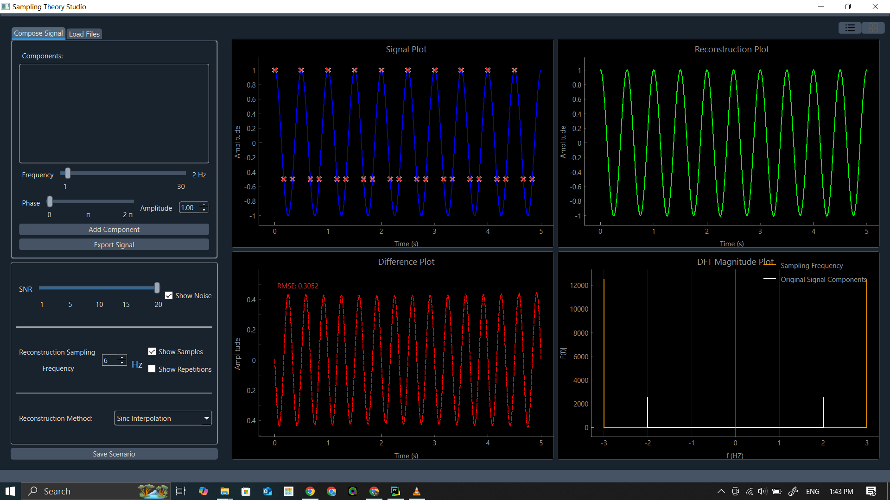
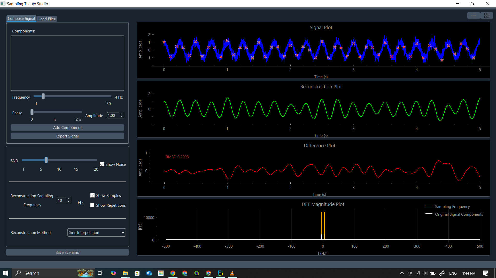
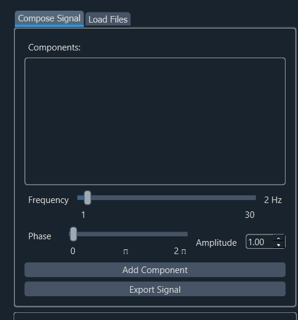
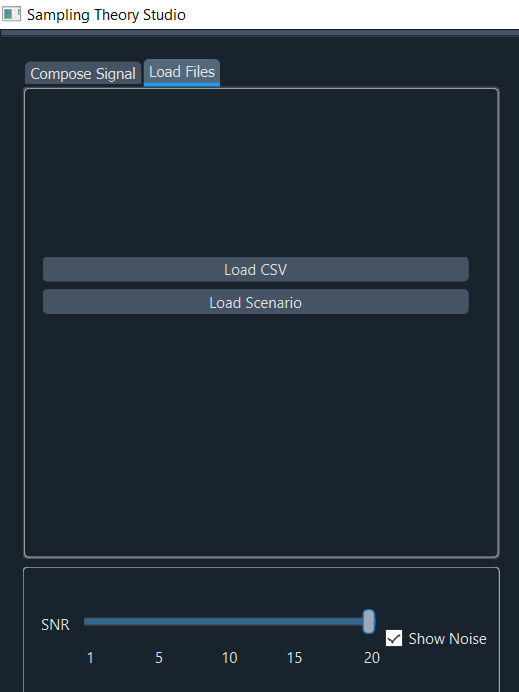
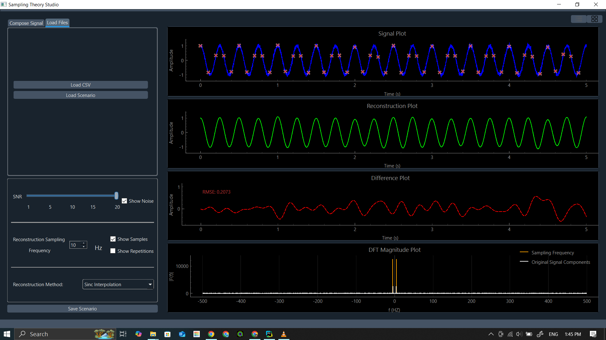

# Sampling Theory Studio

Sampling Theory Studio is a Python application that allows users to reconstruct signals and observe how the sampling rate affects the reconstruction. The application provides various reconstruction methods and a composer to generate custom signals.

## Features

- **Signal Reconstruction**: Reconstruct signals using different methods.
- **Sampling Rate Adjustment**: Observe how changing the sampling rate affects the reconstruction.
- **Signal Composer**: Generate custom signals with desired frequency, amplitude, and phase.
- **Noise Addition**: Add noise to the signal and adjust the Signal-to-Noise Ratio (SNR).
- **Visualization**: Visualize the original signal, reconstructed signal, and the difference between them.
- **Save and Load Scenarios**: Save the whole setup of the app and load it with all its components where you left off

## Working Application
https://github.com/user-attachments/assets/3e5dc4ad-36b4-4f38-8d8a-d10c11639e5c

## Screenshots

### Grid View


### List View



### Signal Composition


### Load Scenario


### Reconstruction Results


## Installation

1. Clone the repository:
    ```sh
    git clone https://github.com/MohamedHisham20/sampling-theory-studio.git
    cd sampling-theory-studio
    ```

2. Install the required dependencies:
    ```sh
    pip install -r requirements.txt
    ```

## Usage

1. Run the application:
    ```sh
    python main.py
    ```

2. Use the GUI to interact with the application.

### Reconstructing a Signal

1. **Load or Compose a Signal**:
    - Use the "Browse CSV" button to load a signal from a CSV file.
    - Or use the composer to generate a custom signal by adjusting the frequency, amplitude, and phase sliders.

2. **Adjust Sampling Rate**:
    - Use the "Reconstruction Sampling Frequency" spin box to set the desired sampling rate.

3. **Select Reconstruction Method**:
    - Choose a reconstruction method from the dropdown menu:
        - Zero Order Hold
        - Linear
        - Sinc Interpolation
        - Cubic Spline
        - Fourier
        - Nearest Neighbor

4. **Add Noise (Optional)**:
    - Check the "Show Noise" checkbox to add noise to the signal.
    - Adjust the SNR using the SNR slider.

5. **Visualize the Results**:
    - The application will display the original signal, reconstructed signal, and the difference between them.
    - The DFT Magnitude Plot will show the frequency components of the signal.

### How Sampling Rate Affects Reconstruction

- **Undersampling**: If the sampling rate is too low, the reconstructed signal will not accurately represent the original signal, leading to aliasing.
- **Nyquist Rate**: Sampling at twice the highest frequency of the signal (Nyquist rate) ensures accurate reconstruction.
- **Oversampling**: Increasing the sampling rate beyond the Nyquist rate can improve the reconstruction but may also introduce unnecessary data points.

## Example

1. **Compose a Signal**:
    - Set frequency to 5 Hz, amplitude to 1, and phase to 0.
    - Click "Add Component" to add the signal component.

2. **Set Sampling Rate**:
    - Set the sampling rate to 15 Hz.

3. **Select Reconstruction Method**:
    - Choose "Sinc Interpolation" from the dropdown menu.

4. **Visualize**:
    - Observe the original and reconstructed signals in the plots.

## License

This project is licensed under the MIT License. See the [LICENSE](LICENSE) file for details.

## Contributors

Special thanks to everyone who has contributed to this project!  

|              | GitHub Profile                     |
|------------------|-----------------------------------|
| [](https://github.com/abdelrahman-alaa-10) | [Abdelrahman Alaa](https://github.com/abdelrahman-alaa-10) |
| [](https://github.com/Ibrahim-Fateen) | [Ibrahim Fateen](https://github.com/Ibrahim-Fateen) |
| [](https://github.com/MohamedHisham20) | [Mohamed Hisham](https://github.com/MohamedHisham20) |
| [](https://github.com/salahmohamed03) | [Salah Mohamed](https://github.com/salahmohamed03) |

### Submitted to
Dr. Tamer Basha & Eng. 
